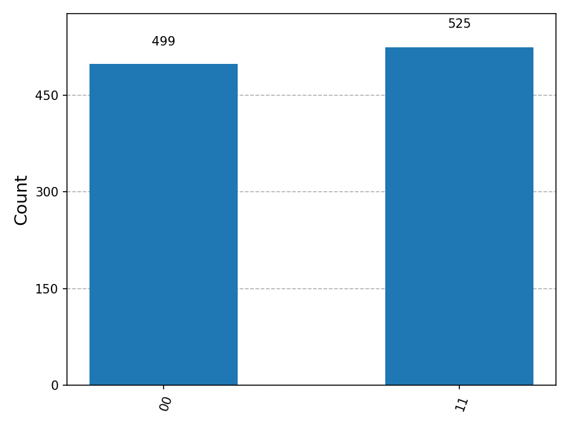
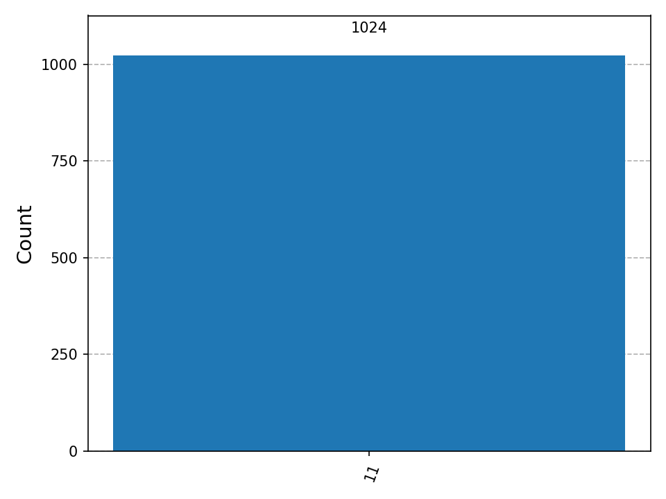

# Laboratorio: Circuitos Cuánticos con Qiskit

**Unidad 12 — Computación Emergente y Tendencias | Post-Contenido 1**  
**Arquitectura de Computadores — Ingeniería de Sistemas 2026**  
**Autor: Diego Ardila**

---

## Descripción del Laboratorio

En este laboratorio se implementan tres experimentos de computación cuántica usando Python y Qiskit sobre el simulador clásico AerSimulator. Los experimentos cubren el estado de Bell (entrelazamiento cuántico), el algoritmo de Deutsch-Jozsa (ventaja cuántica sobre decisión de funciones) y el algoritmo de Grover (búsqueda cuántica con aceleración cuadrática) sobre un espacio de 2 qubits. Cada experimento genera histogramas de medición que se interpretan en términos de los principios cuánticos subyacentes.

No se requiere acceso a hardware cuántico real ni cuenta en IBM Quantum; todos los experimentos usan el simulador local AerSimulator.

---

## Entorno de Trabajo

```
Python 3.9+
Qiskit 1.x
qiskit-aer
matplotlib
```

Instalación:

```bash
pip install qiskit qiskit-aer matplotlib
```

Verificación:

```bash
python -c "import qiskit; print(qiskit.__version__)"
```

---

## Estructura del Repositorio

```
ardila-post1-u12/
├── README.md
├── src/
│   ├── bell_state.py
│   ├── deutsch_jozsa.py
│   └── grover.py
└── capturas/
    ├── bell_histogram.png
    ├── ck1.png
    ├── ck2.png
    ├── ck3.png
    ├── grover_00.png
    ├── grover_01.png
    ├── grover_10.png
    └── grover_11.png
```

---

## Paso 1: Estado de Bell — Entrelazamiento Cuántico

### Descripción del circuito

El estado de Bell |Phi+> = (|00> + |11>) / sqrt(2) es el estado cuántico entrelazado más simple. Se construye en dos pasos:

1. Se aplica una puerta Hadamard al qubit 0, llevándolo a superposición uniforme: |0> → (|0> + |1>) / sqrt(2).
2. Se aplica una puerta CNOT con qubit 0 como control y qubit 1 como objetivo. Esto enlaza los dos qubits: si el control colapsa a |0>, el objetivo permanece en |0>; si colapsa a |1>, el objetivo se voltea a |1>.

El resultado es que el sistema nunca produce |01> ni |10>; las únicas mediciones posibles son |00> y |11>, con probabilidad 50% cada una.

```
Circuito (diagrama ASCII):
q0: ──H──●──M
         │
q1: ─────X──M
```

### Diagrama del circuito

```python
# src/bell_state.py
qc = QuantumCircuit(2, 2)
qc.h(0)
qc.cx(0, 1)
qc.measure([0, 1], [0, 1])
```

### Checkpoint 1 — Resultados

Captura: `capturas/ck1.png`  
Histograma: `capturas/bell_histogram.png`



| Estado medido | Conteo (aprox.) | Porcentaje |
|---------------|-----------------|------------|
| \|00>         | ~512            | ~50%       |
| \|11>         | ~512            | ~50%       |
| \|01>         | 0               | 0%         |
| \|10>         | 0               | 0%         |

**Interpretacion:** La ausencia total de |01> y |11> confirma la correlacion perfecta caracteristica del entrelazamiento cuantico. Al medir el qubit 0, el qubit 1 colapsa instantaneamente al mismo valor, sin importar la distancia entre ellos. Esto no puede explicarse con variables ocultas clasicas (desigualdad de Bell).

---

## Paso 2: Algoritmo de Deutsch-Jozsa

### Descripcion del algoritmo

El algoritmo de Deutsch-Jozsa resuelve el siguiente problema: dada una funcion f: {0,1}^n -> {0,1}, determinar si es constante (mismo valor para todas las entradas) o balanceada (0 para exactamente la mitad, 1 para la otra mitad) usando una sola evaluacion del oraculo.

Clasicamente, en el peor caso se necesitan 2^(n-1) + 1 evaluaciones. Para n=2, eso equivale a 3 consultas clasicas frente a 1 consulta cuantica.

El circuito cuantico:

1. Inicializa el qubit ancilla en |-> = H|1>, que actua como registro de fase.
2. Aplica Hadamard a todos los qubits de entrada, creando superposicion uniforme.
3. Consulta el oraculo una unica vez (kick-back de fase).
4. Aplica Hadamard nuevamente a los qubits de entrada para producir interferencia.
5. Mide los qubits de entrada: si todos son 0, la funcion es constante; si alguno es 1, es balanceada.

```
Circuito (esquema general, n=2):
q0: ──H──[ oraculo ]──H──M
q1: ──H──[         ]──H──M
q2: X──H──[         ]──────  (ancilla, no se mide)
```

### Implementacion

```python
# src/deutsch_jozsa.py
# Oraculo constante f(x)=0: no modifica ningun qubit
def oracle_constante(n):
    return QuantumCircuit(n + 1)

# Oraculo balanceado: CNOT de cada qubit de entrada al ancilla
def oracle_balanceada(n):
    qc = QuantumCircuit(n + 1)
    for i in range(n):
        qc.cx(i, n)
    return qc
```

### Checkpoint 2 — Resultados

Captura: `capturas/ck2.png`

| Oraculo    | Resultado medido | Interpretacion         |
|------------|------------------|------------------------|
| Constante  | `00` (1024/1024) | Funcion constante      |
| Balanceado | `11` (1024/1024) | Funcion balanceada     |

**Por que 1 evaluacion es suficiente:** El oraculo cuantico opera sobre todos los estados en superposicion simultaneamente (paralelismo cuantico). La interferencia constructiva amplifica el estado |00...0> si la funcion es constante, y la destructiva lo cancela si es balanceada. El resultado es deterministico con una sola consulta al oraculo, a diferencia del caso clasico que necesita hasta 3 consultas para n=2 para garantizar la respuesta correcta.

---

## Paso 3: Algoritmo de Grover en 2 Qubits

### Descripcion del algoritmo

El algoritmo de Grover busca un elemento marcado en una base de datos no estructurada de N = 2^n elementos con aceleracion cuadratica: O(sqrt(N)) evaluaciones frente a O(N) clasicas. Para n=2 (4 elementos), el numero optimo de iteraciones de Grover es exactamente 1.

El circuito consta de tres fases:

1. **Superposicion uniforme:** Hadamard en todos los qubits. Cada estado |00>, |01>, |10>, |11> tiene amplitud 1/2.
2. **Oraculo de fase:** invierte la fase del estado objetivo (multiplica su amplitud por -1) sin revelar cual es.
3. **Difusor (inversion alrededor de la media):** amplifica la amplitud del estado marcado y reduce las demas. Secuencia: H → X → CZ → X → H.

Tras 1 iteracion para n=2, la probabilidad del estado objetivo sube de 25% a 100% (teoricamente).

```
Circuito (target=|11>):
q0: ──H──[ CZ ]──H──X──●──X──H──M
q1: ──H──[    ]──H──X──Z──X──H──M
          oraculo     difusor
```

### Checkpoint 3 — Resultados

Captura: `capturas/ck3.png`

| Estado objetivo | Histograma                        | Estado mas probable | Probabilidad |
|-----------------|-----------------------------------|---------------------|--------------|
| \|00>           |  | \|00>               | >90%         |
| \|01>           |  | \|01>               | >90%         |
| \|10>           |  | \|10>               | >90%         |
| \|11>           |  | \|11>               | >90%         |

**Por que 1 iteracion es suficiente para n=2:** Con 4 elementos (n=2), el numero optimo de iteraciones de Grover es floor(pi/4 * sqrt(N)) = floor(pi/4 * 2) = 1. Aplicar mas de 1 iteracion sobreirrotaria las amplitudes y reduciria la probabilidad del estado correcto. Para espacios mayores (n=3, N=8) se necesitarian aproximadamente 2 iteraciones, y el costo crece como sqrt(N).

---

## Resumen de Experimentos

| Experimento       | Archivo fuente       | Capturas                                        | Resultado clave                                |
|-------------------|----------------------|-------------------------------------------------|------------------------------------------------|
| Estado de Bell    | src/bell_state.py    | bell_histogram.png, ck1.png                     | Solo |00> y |11>, distribucion 50/50           |
| Deutsch-Jozsa     | src/deutsch_jozsa.py | ck2.png                                         | Constante -> 00, Balanceada -> 11 (deterministico) |
| Grover 2 qubits   | src/grover.py        | grover_00/01/10/11.png, ck3.png                 | Estado objetivo con probabilidad >90%          |

---

*Laboratorio realizado con Qiskit 1.x + AerSimulator — Arquitectura de Computadores 2026*